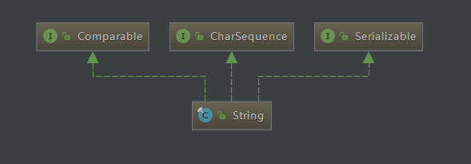

# java.lang.String
## structure

## brief description
用于表示字符串或者字符常量，如"abc"。String一旦被创建后，其值就
不能在发生改变。由于String的不可变性，因而String是可共享的。
在Java中，String的默认编码是UTF-16。String内部存储使用的是char数组。
## 构造器
1. String()  
创建一个空字符串，长度为0。由于String是不可变类型，因此该方法没有实际意义。  
2. String(@Notnull String original)  
拷贝另一个字符串的值以及hash值。由于String是不可变类型，因此该方法没有实际意义。  
3. String(char[] array)  
将一个字符数组转换为一个String对象，内部实现使用的Arrays.copyOf(charArray, length)方法。
Arrays.copyOf()方法交给System.arrayCopy()方法处理。
3. String(char[] array, int offset, int count)  
将array的子数组创建为字符串对象,offset是第一个字符在array的位置，count是后续的
长度。该构造方法会抛出StringIndexOutOfBoundsException。
4. String(int[] codePoints, int offset, int count)  
将unicode编码的code points数组的子数组转换成字符串对象。  
5. String(byte[] ascii, int hiByte, int offset, int count)  
将8位的int数组的子数组转换为字符串。  
6. String(byte[] ascii, int hiByte)  
将8位int数组转换为字符串。  
7. String(byte[] bytes, int offset, int count, String charsetName)  
将byte数组按特定的编码转换成字符串，转换后字符串的长度于bytes的长度可能不相等。  
8. String(byte[] bytes, int offset, int count, Charset charset)  
将byte数组按特定的编码转换成字符串，转换后字符串的长度与bytes的长度可能不相等。  
9. String(byte[] bytes, String charsetName)  
将byte数组按特定的编码转换成字符串，转换后字符串的长度与bytes的长度可能不相等。  
10. String(byte[] bytes, Charset charset)  
将byte数组按特定的编码转换成字符串，转换后字符串的长度与bytes的长度可能不相等。  
11. String(byte[] bytes, int offset, int count)  
将byte数组用平台默认的编码转换成字符串。该方法如果在默认编码转换失败时，尝试使用ISO-8859-1编码，
如果ISO-8859-1编码转换仍然失败，则返回null值。  
12. String(byte[] bytes)  
将bytes数组用平台默认的编码转换为字符串对象，转换后的字符串对象长度与bytes数组长度可能不相等。  
13. String(StringBuilder stringBuilder)  
将StringBuilder对象转换为字符串对象，该方法通过拷贝StringBuilder内部的char数组，来生成新的字符串对象。
所以对StringBuilder对象的修改，不会影响String对象的值。如果想把StringBuilder对象转换为String对象，
更快且推荐的方法是调用StringBuilder对象的toString()方法。  
14. String(char[] value, boolean shared)  
包内私有构造器，且shared永远应该是true。  

## method
### int length()
获取字符串的长度，由于String内部存储字符使用的是char数组，因此该方法实际返回的是char数组的长度。  
### boolean isEmpty()  
判断一个字符串是否为空，如果一个字符串是空字符串，那么这个字符串的长度为0。  
### char charAt(int index)  
返回特定位置的字符。由于String内部是unicode编码，如果某个位置的字符串对应的是unicode里有实际意义的字符，则
该方法返回的是实际的一个unicode字符。如下：  
```$xslt
str = "中国人民真欢喜";
char ch = str[1];
// char should be '国'
```
### int codePointAt(int index)
返回特定位置的unicode code point。
### int codePointBefore(int index) 
返回特定位置前一个位置的unicode code point，相当于codePointAt(index - 1)。
### int codePointCount(int beginIndex, int endIndex)  
返回特定范围了unicode code point的个数。  
### int offsetByCodePoints(int index, int codePointOffset)  
返回给定unicode code point偏移的索引。  
### void getChars(char[] dst, int dstBegin)  
将字符串中的字符从一个给定的位置开始，全部拷入一个char数组中。
### boolean contentEquals(CharSequence cs)
```$xslt
public boolean contentEquals(CharSequence cs) {
        // Argument is a StringBuffer, StringBuilder
        if (cs instanceof AbstractStringBuilder) {
            if (cs instanceof StringBuffer) {
                // 防止cs在迭代比较的时候，被外部线程修改
                synchronized(cs) {
                   return nonSyncContentEquals((AbstractStringBuilder)cs);
                }
            } else {
                return nonSyncContentEquals((AbstractStringBuilder)cs);
            }
        }
        // Argument is a String
        if (cs instanceof String) {
            return equals(cs);
        }
        // Argument is a generic CharSequence
        char v1[] = value;
        int n = v1.length;
        if (n != cs.length()) {
            return false;
        }
        // 逐字符比较
        for (int i = 0; i < n; i++) {
            if (v1[i] != cs.charAt(i)) {
                return false;
            }
        }
        return true;
    }
```


